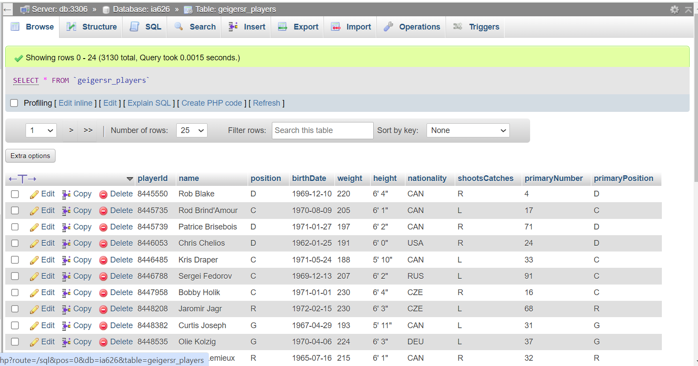
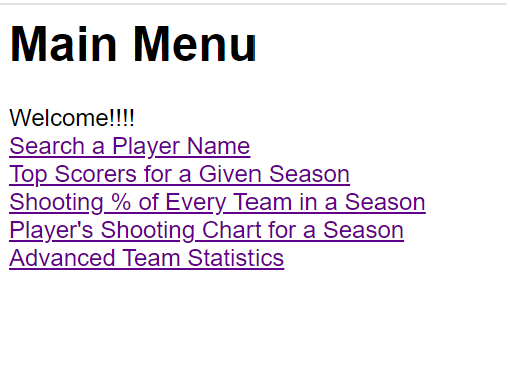

# NHL Player Shot API
### By Sebastian Geiger

## Summary/Initial Question

For my project I want to look more in depth into NHL statistics. I was able to find a dataset that has every single shot taken in an NHL game from 2007-2022. This dataset includes where on the ice the shot was taken from, who the shooter was, the type of shot that was taken and also information about the play around the shooter. My initial question was is there any correlation between any of these shot characteristics and the probability of a goal being scored at a given time. Hockey is a very fast game with a constant flow of play. This makes it difficult to get advanced statistics on parts of the game, unlike other sports like baseball or football that have set pitches and plays that divide the game up into even segments. I wanted to see what players not only generate the most shots, but the highest quality shots based on location, angle, and situation. My goal is to take two flat csv files that contain player descriptions and shot data and turn them into a API that can be utilized by users to gather valuable information about their favorite players. My API will have multiple endpoints that query the data to show different metrics for different groups of players as well as indiviual players over the provided years. 
I also will be adding a second API to this inital API to create visualizations for each endpoint. Instead of reading the data in json format which can be difficult to read and analyse, I will make tables and charts that can be easily interpreted and analyzed. This API will also be more user friendly and able to change views and filters at the click of a button. 
## Outline

#### mysql loading

The first step is to get the csv data that I want to use into a mysql database. I did this by writing a python script to import two tables based on the schema below. The `players` table was simple to enter and I was able to load the table into mysql with ease, only needing to make a date conversion for the `birthDate` field. The 'shots' table did not have any date requirements, but it did have some challenges. Based on the schema below, the `shots` table has two foreign keys that connect to the `playerId` in the `players` table. In the csv files that I pulled the data from the `playerId` fields had different types. In the player csv, the field was read in by python as a interger type, but in the shots datafile, the `shooterPlayerId` and `goalieIdForShot` fields read in as a string with a trailing decimal and zero. This caused a foreign key constraint error to arise due to the Ids not aligning. To fix this I changed the mysql field type to char(7) then added a few lines of cude to cut the '.0' off the end of the Ids, so they aligned with the other table.  

The next step would then be to translate the mysql tables into a json format to be used for the API.

#### Developing API (app.py)

The next step was to begin developing an API that had multiple endpoints that shows users valuable information from the mysql database. The endpoints I created are:
* getPlayer - The user enters a players name and the result is decriptive information about that player (heaight, weight, nationality, etc.)
* getTopScorers - Returns the top 10 goal scorers of the given year regular season or playoffs.
* getTeamShootingPct - Returns all teams shooting percentagre of the given season, regular season or playoffs. 
* getPlayerChart - Returns scatter plot of all the shots taken by a given player in a given regular season or playoffs and the result of the shot. 
* getAdvstats - returns advanced statistics of a given team in a given regular season or playoffs.
I built all these endpoints that conenct to the database where my two SQL tables are stored, then write a query to that database using tokens as placeholders for user inputs in the URL. The result of all the endpoints is json data. If one of the inputs is wrong then an error message will appear telling the user to check their inputs and enter valid values. In the figures section I included images of the outputs of the API's results in json format. Each endpoint takes different arguments that load the page with the desired information for the user. The arguments that the endpoints take are:
* getPlayer - Players name
* getTopScorers - Season and is playoffs
* getTeamShootingPct - Team code, season, and is playoffs
* getPlayerChart - Player name, season, and is playoffs
* getAdvstats - Team code, season, and is playoffs
Most of the endpoints take season and is playoffs as the arguments. This is because for the metrics these endpoints return it makes sense for them to be broken down over a season and for that season to be split between regular season and playoffs. Spliting between the regular season and playoffs get rid of any inbalances between teams and players who did not play in the playoffs. For example for the top scorers, a player who made it to the stanley cup final would have more games and therefore more goals then a player who did not make playoffs. This way the regular season shows players and teams across an 82 game season and the playoffs shows only the best teams to make the playoffs and make it far into the postseason. 

#### Interface and Graphs (main.py)

The final step was to create a second API that read the json from my first API and created visuals for each endpoint. This would be the front end application for my app. I created the same endpoints that my json API had. This time, instead of connecting to the mysql database this API connected to my json API. This API has additional enpoints as well. I set this API up as a user interface that has a main menu page where the user can decide from which of the five endpoints they want to see. From there the endpoint brings them to a page where they can select the arguments they want to pass for the endpoint. When they hit the submit button on that page the user will be directed to the endpoint with the selected arguments passed. The endpoints I created for this API are:
* getPlayer - Table of players attributes
* getTopScorers - Bar graph of goals scored for the top 10 players
* getTeamShootingPct - Bar graph of all teams shooting percentages
* getPlayerChart - Scatter plot of all shots taken by a player and the outcome
* getAdvstats - Table of advanced statistics for a team
* selectPlayer - Select players name for getPlayer endpoint
* selectSeason - Select season year and is playoff for getTopScorers endpoint
* selectSeason2 - Select season year and is playoff for getTeamShootingPct endpoint
* SelectPlayerSeason - Select player name, season year and is playoff for getPlayerChart endpoint
* SelectTeamSeason - Select team code, season year and is playoff for getAdvStats endpoint

These endpoints all have html pages that associate with them that display them on the browser. The pages also have links to the main menu and select pages so the user can navigate through the pages without needing to change the url or leave the API. For the getPlayerChart endpoint, it shows a scatter plot of shots taken in a season for a player and their outcome. I could not get an image as the background so I drew the outline of a half of a hockey rink with lines with a red diamond representing the goal. The goal line is at x-axis 89 and the center ice line is at 0 on the x-axis. This outline can give the user a better understanding of where shots were taken on the ice related to the goal. 

## Python Code

#### 'geigersr_players' Table Creation and Insertion

```
import pymysql, csv, time
import datetime
with open('allPlayersLookup.csv') as f:
    data = [{k: str(v) for k, v in row.items()}
        for row in csv.DictReader(f, skipinitialspace=True)]

conn = pymysql.connect(host='mysql.clarksonmsda.org', port=3306, user='ia626',
                       passwd='ia626clarkson', db='ia626', autocommit=True) 
cur = conn.cursor(pymysql.cursors.DictCursor)
cur.execute("DROP TABLE IF EXISTS `geigersr_shots`;")
cur.execute("DROP TABLE IF EXISTS `geigersr_players`;")
sql = """CREATE TABLE `geigersr_players`
(
  `playerId` CHAR(7) NOT NULL,
  `name` VARCHAR(30) NOT NULL,
  `position` CHAR(1) NULL,
  `birthDate` DATE NULL,
  `weight` varchar(3) NULL,
  `height` VARCHAR(8) NULL,
  `nationality` CHAR(3) NULL,
  `shootsCatches` CHAR(1) NULL,
  `primaryNumber` varchar(2) NULL,
  `primaryPosition` CHAR(1) NULL,
  PRIMARY KEY (`playerId`)
);"""
cur.execute(sql)
sql = '''INSERT INTO `geigersr_players` (`playerId`,`name`,`position`,`birthDate`,`weight`,`height`,`nationality`,
  `shootsCatches`,`primaryNumber`,`primaryPosition`) VALUES (%s,%s,%s,%s,%s,%s,%s,%s,%s,%s)'''
n = 0
blocksize = 500
tokens = []
for row in data:
    dto = None
    try:
        dto = datetime.datetime.strptime(row['birthDate'],"%m/%d/%Y")
    except Exception as e:
        #print(e)
        pass
    if dto is not None:
        dts = dto.strftime("%Y-%m-%d")
    else:
        dts = None
    tokens.append([row['playerId'],row['name'],row['position'],dts,
                    row['weight'],row['height'],row['nationality'],row['shootsCatches'],
                    row['primaryNumber'],row['primaryPosition']])
    if len(tokens) >= blocksize:
        cur.executemany(sql,tokens)
        tokens = []
    if n % 1000 == 0:
        print(n)
    n += 1
if len(tokens) > 0:
    cur.executemany(sql, tokens)
```

#### 'geigersr_shots' Table Creation and Insertion

```
cur.execute("DROP TABLE IF EXISTS `geigersr_shots`;")
sql = ''' CREATE TABLE `geigersr_shots`
(
  `shotID` INT NOT NULL,
  `arenaAdjustedXCord` INT NOT NULL,
  `arenaAdjustedYCord` INT NOT NULL,
  `averageRestDifference` NUMERIC(7,2) NOT NULL,
  `event` VARCHAR(5) NOT NULL,
  `game_id` INT NOT NULL,
  `goal` INT NOT NULL,
  `isPlayoffGame` INT NOT NULL,
  `lastEventCategory` VARCHAR(10) NOT NULL,
  `season` INT NOT NULL,
  `shotAngle` NUMERIC(11,9) NOT NULL,
  `shotDistance` NUMERIC(12,9) NOT NULL,
  `shotGeneratedRebound` INT NOT NULL,
  `shotGoalieFroze` INT NOT NULL,
  `shotOnEmptyNet` INT NOT NULL,
  `shotRebound` INT NOT NULL,
  `shotRush` INT NOT NULL,
  `shotType` VARCHAR(10) NOT NULL,
  `shotWasOnGoal` INT NOT NULL,
  `team` CHAR(4) NOT NULL,
  `teamCode` CHAR(3) NOT NULL,
  `time` INT NOT NULL,
  `goalieId` char(7) NOT NULL,
  `shooterId` char(7) NOT NULL,
  PRIMARY KEY (`shotid`),
  FOREIGN KEY (`goalieId`) REFERENCES `geigersr_players`(`playerId`),
  FOREIGN KEY (`shooterId`) REFERENCES `geigersr_players`(`playerId`)
);  '''
cur.execute(sql)
sql = '''INSERT INTO `geigersr_shots` ( `shotID`,`arenaAdjustedXCord`,`arenaAdjustedYCord`,`averageRestDifference`,`event`,
  `game_id`,`goal`,`isPlayoffGame`,`lastEventCategory`,`season`,`shotAngle`,`shotDistance`,`shotGeneratedRebound`,
  `shotGoalieFroze`,`shotOnEmptyNet`,`shotRebound`,`shotRush`,`shotType`,`shotWasOnGoal`,`team`,`teamCode`,`time`,`goalieId`,
  `shooterId`) VALUES (%s,%s,%s,%s,%s,%s,%s,%s,%s,%s,%s,%s,%s,%s,%s,%s,%s,%s,%s,%s,%s,%s,%s,%s)'''
n = 0
blocksize = 500
tokens = []
for row in data:
    shooter = row['shooterPlayerId']
    shooter2 = id.split('.')
    shooterid = shooter2[0]
    goalie = row['goalieIdForShot']
    goalie2 = id.split('.')
    goalieid = shooter2[0]
    tokens.append([row['shotID'],row['arenaAdjustedXCord'],row['arenaAdjustedYCord'],row['averageRestDifference'],row['event'],
                    row['game_id'],row['goal'],row['isPlayoffGame'],row['lastEventCategory'], row['season'], row['shotAngle'],
                    row['shotDistance'],row['shotGeneratedRebound'],row['shotGoalieFroze'], row['shotOnEmptyNet'],
                    row['shotRebound'],row['shotRush'],row['shotType'],row['shotWasOnGoal'],row['team'],row['teamCode'],
                    row['time'],goalieid,shooterid])
    if len(tokens) >= blocksize:
        cur.executemany(sql,tokens)
        tokens = []
    if n % 10000 == 0:
        print(n)
    n += 1
if len(tokens) > 0:
    cur.executemany(sql, tokens)
```

#### Example Endpoint Code JSON endpoint

```
@app.route("/getTopScorers", methods=['GET','POST'])
def getTopScorers():
    conn = pymysql.connect(host='mysql.clarksonmsda.org',port=3306,user='ia626',passwd='ia626clarkson', db='ia626', autocommit=True)
    cur = conn.cursor(pymysql.cursors.DictCursor)
    sql = '''SELECT p.`name`,COUNT(s.`goal`) as `goals` FROM `geigersr_shots` s, `geigersr_players`p WHERE p.`playerId` = s.`shooterId`
                AND s.`goal` = 1 AND s.`season` = %s  and isPlayoffGame = %s GROUP BY s.`shooterId` ORDER BY `Goals` DESC LIMIT 0,10;'''
    season = request.args.get('season')
    playoffs = request.args.get('playoffs')
    print(season,playoffs)
    tokens = [season,playoffs]
    cur.execute(sql,(tokens))
    rows = []
    for row in cur:
        d = {}
        d['name'] = row['name']
        d['goals'] = row['goals']
        rows.append(d)
    if len(rows) > 0:
        res['code'] = 1
        res['msg'] = 'ok'
        res['req'] = '/getTopScorers'
        res['rows'] = rows
    else:
        res['code'] = 0
        res['msg'] = 'Please enter a year between 2007 and 2022 and if playoffs is True/False'
        res['rows'] = None
    return json.dumps(res,indent=4)
```

#### Example Code from Plotly endpoint

```
@app.route('/getTopScorers')
def getTopScorers():
    season = request.args.get("season")
    playoffs = request.args.get("playoffs")
    url = f'http://127.0.0.1:5000/getTopScorers?season={season}&playoffs={playoffs}'
    r = requests.get(url)
    data = json.loads(r.text)
    chart = {'x':[],'y':[]}
    for row in data['rows']:
        chart['x'].append(row['name'])
        chart['y'].append(int(row['goals']))
    return render_template('getTopScorers.html', title='Top Goal Scorers', msg=f'The Top 10 Goal Scorers in {season}',data=chart)
```

## Figures

* Mysql Tables




* json endpoints


* Navigation through plotly application

The main menu of the application, select an endpoint


Select the attributes for getTopScorers endpoint


View enpoint results


Back to main menu or select new attributes


## Results

The results of this project was two working APIs, one that reads data from two mysql tables and loads five different endpoints that are results fo SQL queries in json format. The other API reads the json output from the API and using that data to make visualizations for each endpoint. Above I have pictures of examples from each endpoints. Each of the endpoints has a different visualization that is dynamic and changess when its inputs change. This allows the user to decide what season they want to investigate, or whether or not it was the playoffs of that season. The user can also pick their favorite player or team to get descriptions or advanced statistics about them. 
In my user interface I created a main menu page that can take the user to every different page in the application. They can navigate from page to page using links and buttons. All the endpoints have links that can return the user back to the main menu or back to the select attributes page to reload the endpoint with new information. 

# Code/API appendix
* app.py - json api connected to mysql database
* main.py - plotly api connected to app.py
* test.ipynb - test client for app.py json endpoints
* insertmysql.ipynb - code used to load sql data from csv files
* templates folder - contains all html pages used in plotly api
* img folder - contains images saved for README

